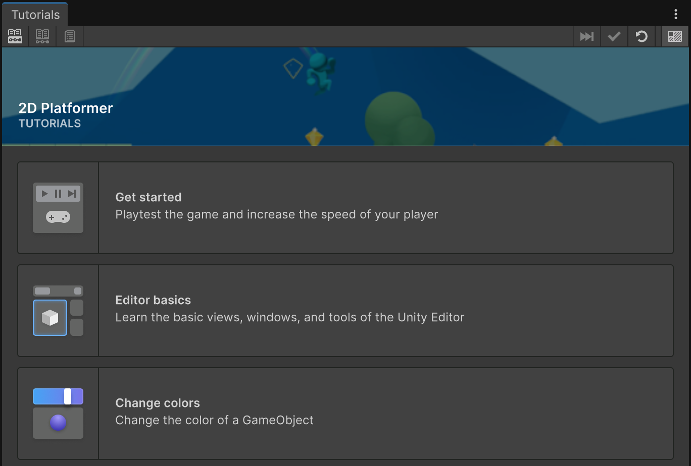
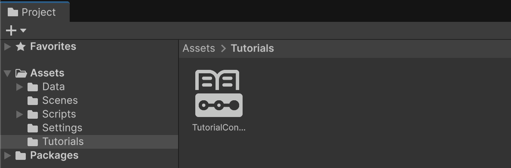
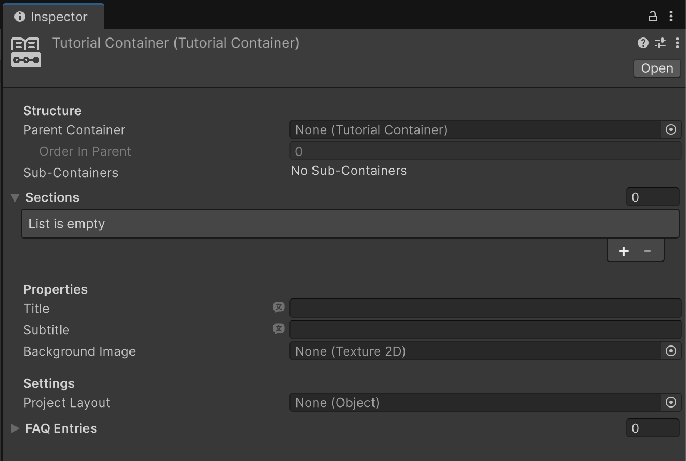

# Tutorial Containers

Tutorial Containers are used to group [Tutorials](tutorials.md).

Within the **Tutorials** window, a Container displays all its children (that is, the "Sections") as a list of clickable buttons, with each one having a title, subtitle, and icon.

With Containers, you can organize your content into macro-areas and give it structure. You can either have only one Container in the whole project, or multiple Containers nested into each other to create a hierarchy.

Containers can also include external links in addition to Tutorials. External links are displayed similarly to Tutorial buttons, but they are clearly identified by the link arrow icon to the right:

## Creating a new Tutorial Container

To create and configure a Tutorial Container asset, follow these instructions:

1. In the **Project** window, right-click in a folder and select **Create** > **Tutorials** > **Tutorial Container**.

A new Tutorial Container ScriptableObject will be created:

## Displaying a Tutorial Container

Differently from [Tutorials](tutorials.md), Containers don't need any setup to be displayed. By default, a newly created Container will appear as a root-level button as soon as the **Tutorials** window is opened.

When Containers are nested into each other (i.e. when the **Parent Container** property is assigned), they appear in the Tutorials window as buttons inside their parent asset, just like Tutorials do.

## Tutorial Container Properties

#### Structure
Properties associated to how the Container is related to other Containers.

| Property&emsp;&emsp;&emsp;&emsp;&emsp;&emsp;&emsp;&emsp; | Description |
| :---- | :---- |
| **Parent Container** | If no Container is provided here, it means this Container is a root, visualized as the first thing once the **Tutorials** window opens, and represents the beginning of the learning journey. If a parent is provided, this Container becomes a child of it. |
| &emsp;&emsp;**Order in Parent** | If a parent is provided, this property indicates what order is this Container within its parent's table of contents. This property is read-only. |
| **Sub-Containers** | This is not a property you assign, but rather a visualization of other Tutorial Containers that have indicated this one as their parent. |

#### Sections
Sections can be either a Tutorial or an external link.

| Property | Description |
| :---- | :---- |
| **Heading** | The title displayed in the section card. |
| **Text** | A subtitle that displays in the section card. |
| **Image** | This is used as the card's background. |
| **Type** | Whether the section is a Tutorial or an External link. |
| **Tutorial** | Which Tutorial asset is opened when the button is clicked (only applies to Tutorial sections). |
| **URL** | Which URL is opened when the button is clicked (only applies to External Link sections). |
| **Metadata** | The metadata appended to the URL opened when the button is clicked (only applies to External Link sections). |

#### Properties
The information displayed in the **Tutorials** window when this Container is listed.

| Property | Description |
| :---- | :---- |
| **Title** | The title of the Container. |
| **Subtitle** | The subtitle of the Container. |
| **Background Image** | An image to use as the background of the Container's card. |

#### Settings
Other functionality associated to the Tutorial Container.

| Property | Description |
| :---- | :---- |
| **Project Layout** | An Editor layout to load when the Container is selected in the **Tutorials** window. Can override the base layout specified in the [Tutorial Project Settings](tutorial-project-settings.md). |
| **FAQ Entries** | A list of frequently asked questions that relate to the Container. These are only visualized when the user is inside a Tutorial. |
